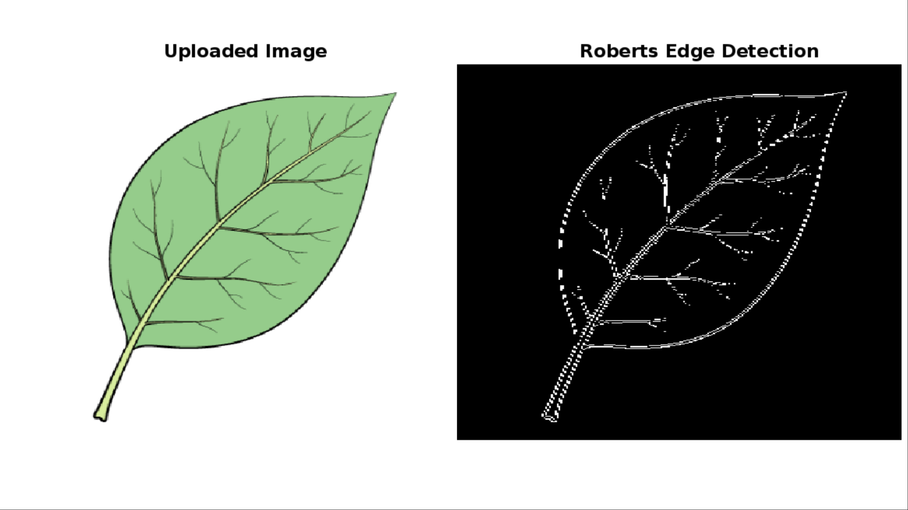

# Image Edge Detection MATLAB Live Script

This MATLAB script implements various edge detection algorithms to identify image boundaries.

## Features:

    1. Applies Canny, Roberts, Sobel, Prewitt, LoG, zerocross, Kirsch, and Craig's edge detectors.
    2. Takes user input for image path, display preference, and edge detection method.
    3. Visualizes both original and edge-detected images.
    4. Saves output images for further analysis.
    
## How to Use:

    1. Clone the repository to your local machine.
    2. Open the MATLAB Live Script (script.mlx) in MATLAB.
    3. Adjust the user inputs (Live Contols) section if needed.
    4. Run the script in MATLAB.
    
### Results

    1. The original image will be displayed if specified.
    2. The image with detected edges will be displayed and saved in the specified output path.

Feel free to explore different input images and edge detection methods to observe their impact on the results.
We hope this simple README provides a concise overview of the script and encourages your exploration of image edge detection in MATLAB.
